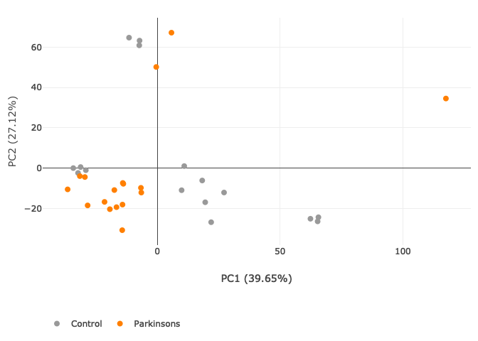
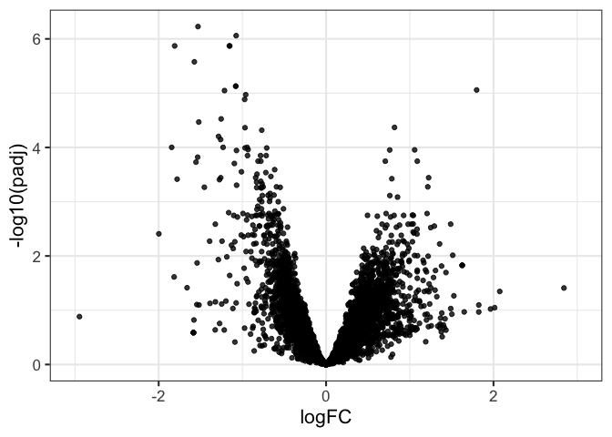

<!-- README.md is generated from README.Rmd. Please edit that file -->

# FacileArchs4Data

This package is a work in progress and aims to implement the Facile API
over the \[ARCHS4\]\[\] (v2) datasets.

Currently the package doesn’t provide much functionality except for easy
wrappers to construct bioconductor expression containers (DGEList,
SummarizedExperiment, etc.) out of whatever subset of samples and genes
that you like.

## Installation

You’ll need to download the archs4 hdf5 files yourself form their
[download page](https://archs4.org/download). I put them in versioned
directories somewhere on my system, like:

    ~/workspace/data/archs4/v2.6/human_gene_v2.6.h5
    ~/workspace/data/archs4/v2.6/mouse_gene_v2.6.h5

Then install this package from github:

``` r
pak::pak("facilebio/FacileArchs4Data")
```

## Usage

Currently you should use the `a4 <- Archs4Client$new("mouse")` (or
`"human"`) R6 constructor to get a thin wrapper around the data object.
Then, subset the `a4$samples` tibble to include the the samples you want
to analyze. Finally, convert the sample-frame it to a `DGEList` or
`SummarizedExperiment` to move on with your life – see the **Usage**
section for details.

To make your life easy, store the “equally versioned” mouse and human
datasets in a single directory (`$ARCHS4_DATADIR`) with the value of
`species` in the filename, and set a global R option (`archs4.data_dir`)
to `$ARCHS4_DATADIR`.

You can put new/old h5 files in different directories, then load the
dataset by specifying simply the species. See the **Installation**
section for more details.

Note that when you load the hdf5 file, a subset of columns will be
loaded for all of the samples by default. This is the (likely few second
delay) you experience when calling the `$new()` constructor for the
first time.

``` r
library(FacileArchs4Data)
library(tidyverse)
theme_set(theme_bw(base_size = 16))
# NOTE: You can set this in your ~/.Rprofile file to make your life easier
options(archs4.data_dir = "~/workspace/data/archs4/v2.6")
a4h <- Archs4Client$new("human")
```

## Finding samples / expreiments of interest

Some of the funtions in this package are fashioned after the archs4py
package, so there is a `$search()` function made available to you that
enables you to search the metadata of each sample based on some of the
decault columns.

Let’s say you were interested in searching for “parksinsons” related
samples:

``` r
samples.park <- a4h$search("parkinson")
```

This will return a tibble of samples where the word `"parkinson"`
appears in one of hte meta data fields:

``` r
head(samples.park)
#> # A tibble: 6 × 16
#>   h5idx series_id geo_accession sample     source_name_ch1                 title
#>   <int> <chr>     <chr>         <chr>      <chr>                           <chr>
#> 1 11365 GSE62642  GSM1530726    GSM1530726 iPS cell-derived neuronal samp… Spor…
#> 2 11366 GSE62642  GSM1530727    GSM1530727 iPS cell-derived neuronal samp… Spor…
#> 3 11371 GSE62642  GSM1530732    GSM1530732 iPS cell-derived neuronal samp… PD-1…
#> 4 11372 GSE62642  GSM1530733    GSM1530733 iPS cell-derived neuronal samp… PD-1…
#> 5 11373 GSE62642  GSM1530734    GSM1530734 iPS cell-derived neuronal samp… PD-2…
#> 6 11374 GSE62642  GSM1530735    GSM1530735 iPS cell-derived neuronal samp… PD-2…
#> # ℹ 10 more variables: singlecellprobability <dbl>, alignedreads <dbl>,
#> #   molecule_ch1 <chr>, library_source <chr>, library_selection <chr>,
#> #   platform_id <chr>, instrument_model <chr>, data_processing <chr>,
#> #   extract_protocol_ch1 <chr>, characteristics_ch1 <chr>
```

The sample metadata tibble is also easily available in the `$samples`
tibble, and you can search for rows of interest “as you are used to”.

## Expression Analysis

Let’s say you already knew you were interested in using the `"GSE40710"`
dataset (aSyn polyA-RNAseq in PD and unaffected cortical brain samples)
to explore the gene expression differencs between healthy and
parkinson’s brain transcriptomes.

We can easily extract the samples in this dataset like so:

``` r
samples <- filter(a4h$samples, series_id == "GSE40710")
```

Your next challenge will be to identify which samples belong to healthy
vs affected individuals. The data in archs4 matches what is provided in
the GEO database, and there are unfortunately no standards as far as
data/sample annotations go, so each individual experiment will provide
you with its own set of challenges.

Often, the sample-level metadata you will be most interested will be in
the `"source_name_ch1"` and `"title"` columns:

``` r
set.seed(0xBEEF)
samples |> 
  sample_n(6) |> 
  select(sample, title, source_name_ch1)
#> # A tibble: 6 × 3
#>   sample    title                     source_name_ch1
#>   <chr>     <chr>                     <chr>          
#> 1 GSM999587 Parkinson's Disease PD 13 Brain cortex   
#> 2 GSM999584 Parkinson's Disease PD 10 Brain cortex   
#> 3 GSM999560 Control Und. 2            Brain cortex   
#> 4 GSM999589 Parkinson's Disease PD 15 Brain cortex   
#> 5 GSM999583 Parkinson's Disease PD 9  Brain cortex   
#> 6 GSM999572 Control Und. 14           Brain cortex
```

We can see that the parkinson’s vs control status is in the `"title"`
column. Let’s great a “group” column with the affected status, and then
use the `biocbox` function in this package to retrieve the associated
expression data for these samples and turn all of it into a DGEList for
downstream analysis.

``` r
y <- samples |> 
  mutate(
    # extract control/parksinson & remove the title column
    group = sub(" .*", "", title),
    # the "'" to make `group` a well behaved R variable
    group = sub("'", "", group)
  ) |> 
  biocbox(class = "DGEList")
```

Now you are ready to analyze `y` using your favorite edgeR/limma
workflow.

## FacileData Integration

If you have the FacileBiocData and FacileAnalysisShine package
installed, you can then use `y` for interactive analysis.

``` r
library(FacileBiocData)
library(FacileAnalysisShine)
yf <- facilitate(y)
```

### Principal Components Analysis

``` r
ypca <- fpca(yf)
viz(ypca, color_aes = "group")
```

<!-- -->

### Differential Expressoin Analysis

``` r
ydge <- yf |> 
  flm_def(covariate = "group", numer = "Parkinsons", denom = "Control") |> 
  fdge(method = "voom")
#> Warning in .filter_count_assay(x, des.matrix, filter.cols, filter_universe, :
#> Only 12.07% (8108) of features are retained after filtering.
```

``` r
ydge |> 
  tidy() |> 
  ggplot(aes(x = logFC, y = -log10(padj))) +
  geom_point(alpha = 0.8) +
  xlim(-3, 3)
```

<!-- -->

Or if you’re webgl-powered:

``` r
viz(ydge, type = "volcano", ntop = 2000)
```

<!-- -->

Refer to the
[FacileAnalysis](https://facilebio.github.io/FacileAnalysis/)
documentation for more analysis fun.

## License

Please note that the use of archs4 data is subject to its own agreement
/ licensing restrictions. Be sure to follow those.

The code in this package is released under the [Apache 2
License](https://www.apache.org/licenses/LICENSE-2.0).

## Acknowledgements

Thanks to Alexander Lachmann and The Ma’ayan Laboratory for the
development and continued updates to the \[ARCHS4 project\]\[archs4\].
